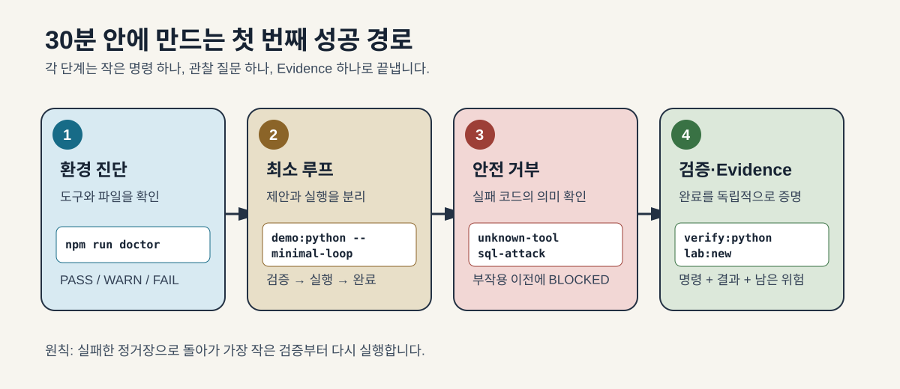
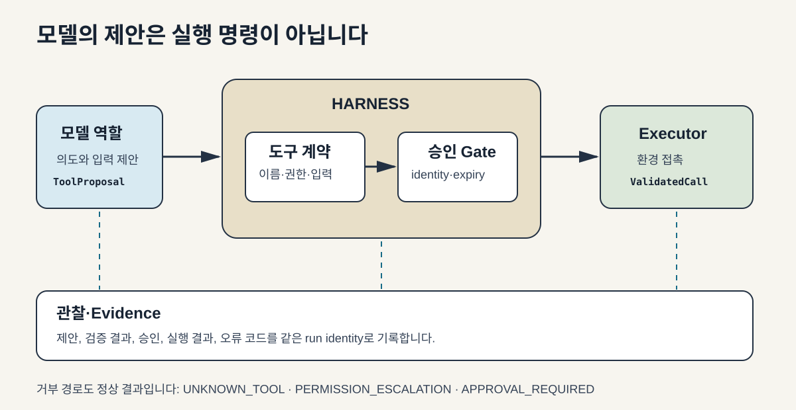
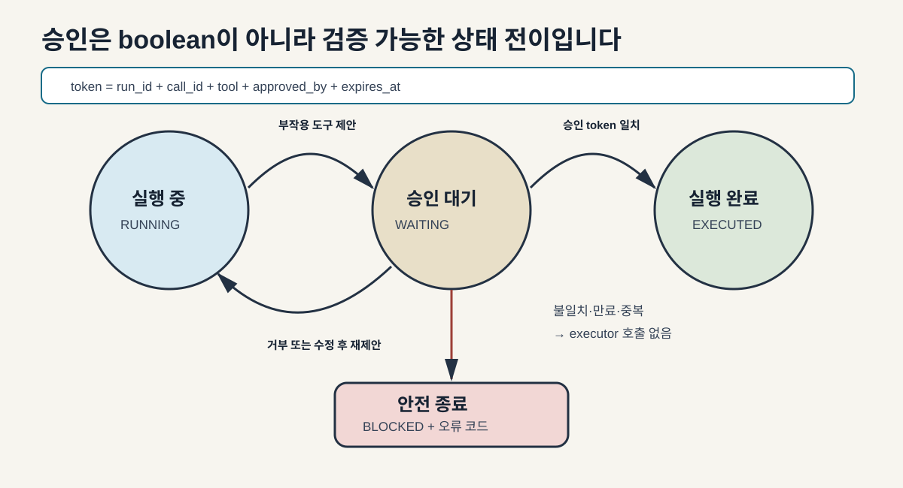
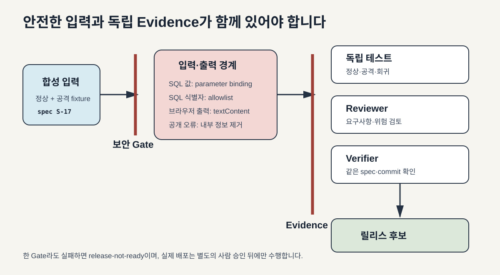

# 그림으로 보는 Harness Engineering

긴 설명보다 흐름을 먼저 보고 싶은 학습자를 위한 자료입니다. 이미지는 색만으로 상태를 구분하지 않으며, 번호·라벨·화살표를 함께 사용합니다.

## 1. 30분 시작 경로

처음에는 네 개의 정거장만 통과합니다. 실패하면 전체 검증을 반복하지 말고 현재 정거장의 가장 작은 명령으로 돌아갑니다.

## 2. 모델과 환경 사이의 하네스 경계

모델은 의도를 제안하고, 하네스는 허용된 형태로 좁히며, executor만 실제 환경에 접촉합니다. 관찰 로그는 모든 단계를 따라갑니다.

## 3. 승인 상태 머신

승인은 단순한 `true` 값이 아닙니다. 현재 run과 call, tool, 승인자, 만료 시각이 모두 일치해야 다시 실행 상태로 돌아갑니다.

## 4. 보안과 Evidence의 이중 Gate

보안 검증만으로 완료되지 않고, 테스트·Reviewer·Verifier Evidence가 같은 spec과 commit을 가리켜야 릴리스 후보가 됩니다.

그림의 원본 SVG는 확대해도 선명하며 강의 슬라이드와 사내 학습 노트에 Apache-2.0 조건으로 재사용할 수 있습니다.
