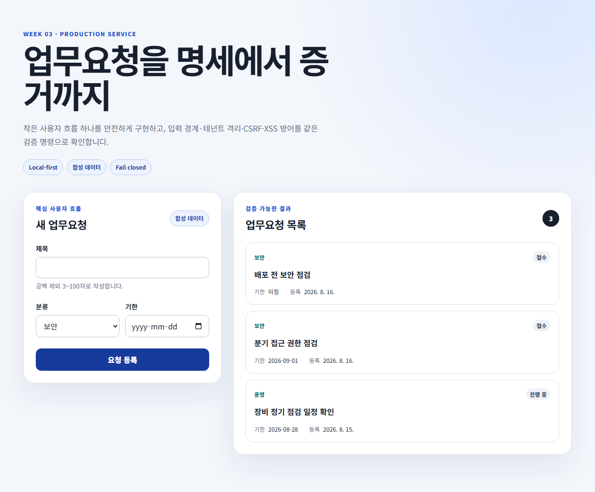

# 3주차 · 업무요청 서비스와 출고 증거

## 기능

- 합성 업무요청 목록·생성·상세 API
- 제목 3~100자, category, 선택 due date 검증
- development용 memory repository와 Supabase/RLS 선택 adapter
- tenant 격리와 일반화된 404
- same-origin + double-submit CSRF 방어
- React text escaping, nonce CSP, 안전한 URL helper
- unit·component·security·Chromium E2E·Next production build

## 로컬 실행

```powershell
npm run dev --workspace=@handbook/week-03-production-service
```

브라우저에서 `http://localhost:3000`을 열면 합성 데이터만 사용하는 demo 모드가 실행됩니다. demo auth와 memory data는 Production에서 거부됩니다.

## 전체 검증

```powershell
npm run verify:week3
```

Playwright Chromium이 없으면 저장소 루트에서 다음을 한 번 실행합니다.

```powershell
npx playwright install chromium
```

## Supabase 선택 실습

1. `supabase/migrations/202608160001_create_work_requests.sql`을 개발 프로젝트에만 적용합니다.
2. `.env.local`에 URL·publishable key를 넣고 `LAB_DATA_MODE=supabase`, `LAB_AUTH_MODE=supabase`를 설정합니다.
3. API 요청은 실제 사용자 access token을 `Authorization: Bearer`로 전달해야 합니다.
4. user `app_metadata.tenant_id`가 RLS와 동일 tenant인지 확인합니다.
5. 다른 tenant ID, SQLi 형태 ID, 만료 token을 공격 fixture로 재검증합니다.

브라우저 로그인 UI와 Vercel/Supabase 조직 설정은 계정이 필요한 외부 단계입니다. 로컬 검증 통과와 Production 배포 완료를 혼동하지 마십시오.

## UI 미리보기



desktop·mobile 캡처 방법과 파일 목록은 [UI 캡처 문서](docs/assets/README.md)를 확인하십시오.

## 보안 코딩 예

금지:

```ts
const sql = `select * from work_requests where id = '${requestId}'`;
```

사용:

```ts
await client.from("work_requests").select("id,title").eq("id", requestId);
```

사용자 출력은 `<h2>{request.title}</h2>`처럼 text로 렌더링하며 raw HTML을 사용하지 않습니다.
